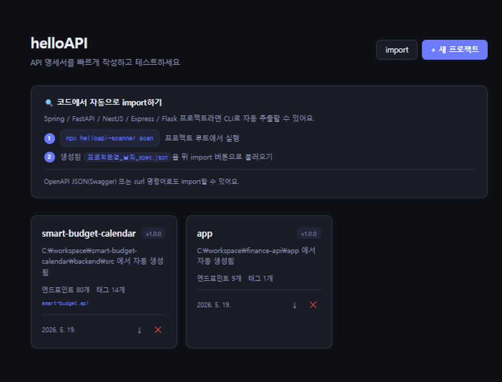
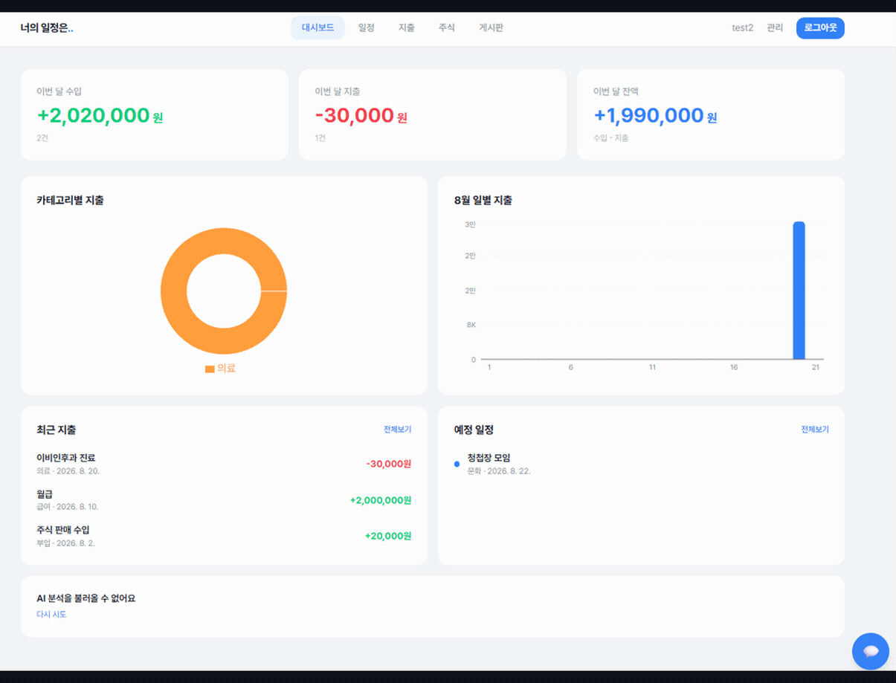
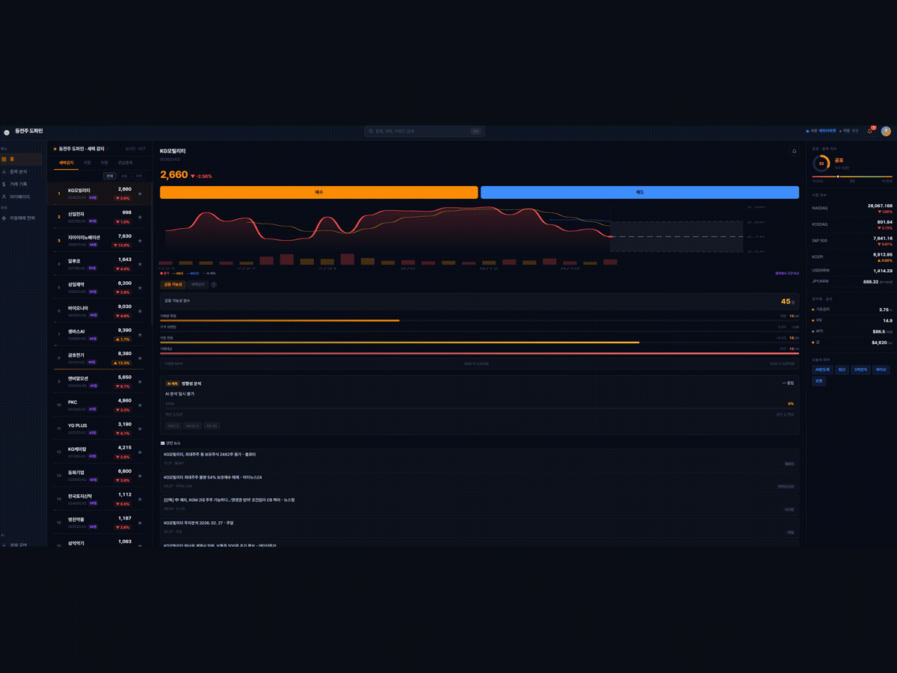

# 정원진

**Backend Developer**

 

> 성실함과 문제 해결 능력은 개발자의 가장 기초적인 덕목이라고 생각합니다.
> 예상치 못한 기술적 난관을 마주해도 회피하지 않고 근본 원인을 파악해 구조적으로 해결하려 합니다.

 

### 🛠 Stack

**언어**

**스크립트 언어**

**프레임워크**

**인프라 · 기타**

 

### 📌 대표 프로젝트

#### [helloAPI](여기에_저장소_링크)

API 명세 자동 문서화 & 테스트 도구. CLI로 코드(Spring / FastAPI / NestJS / Express / Flask)를 스캔해 API 스펙을 추출하고, 웹에서 xlsx·OpenAPI 문서로 출력하거나 바로 요청 테스트까지 할 수 있습니다. `npx helloapi-scanner scan` 한 줄로 실행되는 CLI를 npm에 배포했고, 웹앱은 GitHub Actions로 S3 + CloudFront에 자동 배포됩니다.

`React` `TypeScript` `pnpm workspaces` `GitHub Actions`

 

#### [smart-budget-calendar](https://github.com/Jinny0827/smart-budget-calendar)

일정·수입/지출·주식 매매 기록을 한 화면에서 관리하는 스마트 가계부. 카테고리별 지출 통계, 캘린더 연동, AI 분석 기능을 포함합니다.

`TypeScript`

 

#### 지금(JIGEUM) · 동전주 도파민

실시간 시세 기반 주식 분석 서비스. 거래량·등락률 패턴으로 세력 감지 신호를 만들고 AI가 수치를 해석해 인사이트로 제공합니다. 골든크로스·RSI·볼린저밴드 등 10종 이상의 조건으로 자동매매 전략을 구성할 수 있고, WebSocket 실시간 시세와 증권사 Open API 연동까지 구현했습니다. 현재 로컬에서 개발 중이며 아직 배포 전입니다.

`Java(Netty)` `React` `PostgreSQL` `WebSocket`

 

### 📊 GitHub Stats

 

📄 [경력기술서 / 이력서](여기에_링크) · ✍️ [기술 블로그](https://wjjung.tistory.com/)

